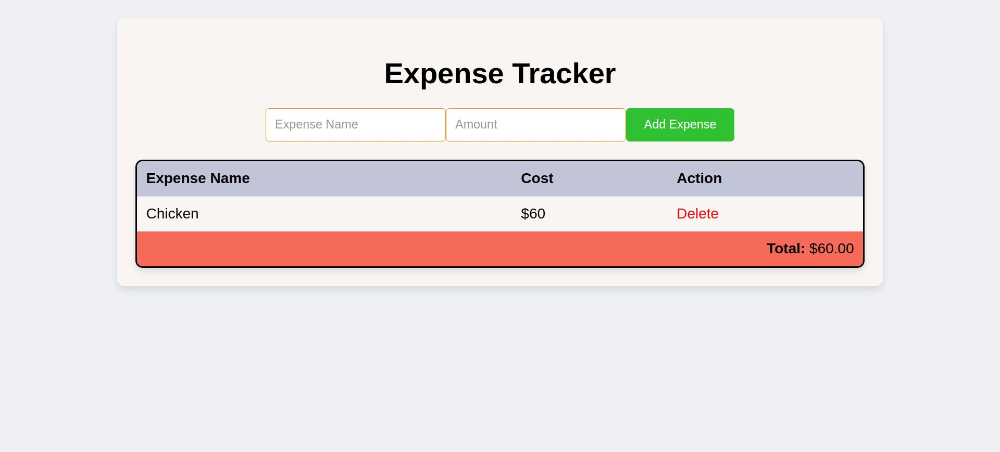

# Expense Tracker Web App



## Overview

The Expense Tracker Web App is a simple tool designed to help you keep track of your expenses. It allows you to add, view, and delete expenses, providing a straightforward way to manage your financial transactions.

## Features

- **Add Expense:** Easily add new expenses with a name and amount.
- **Delete Expense:** Remove unwanted expenses with a click.
- **Total Amount:** The app calculates and displays the total amount of your expenses.
- **Responsive Design:** Works well on various devices, ensuring a seamless experience.

## Demo

[Link to Live Demo](https://alpattex.github.io/Expense-Tracker/)

## Getting Started

### Prerequisites

Make sure you have the following installed:

- Web browser

### Installation

1. Clone the repository:

```bash
git clone https://github.com/your-username/expense-tracker.git
```

2. Open `index.html` in your web browser.

## Usage

1. Open the web app in your browser.
2. Add your expenses using the provided form.
3. View and manage your expenses in the table.
4. Enjoy keeping track of your spending!

## Contributing

Contributions are welcome! If you have ideas for improvements, open an issue or create a pull request.

## License

This project is licensed under the [MIT License](LICENSE).